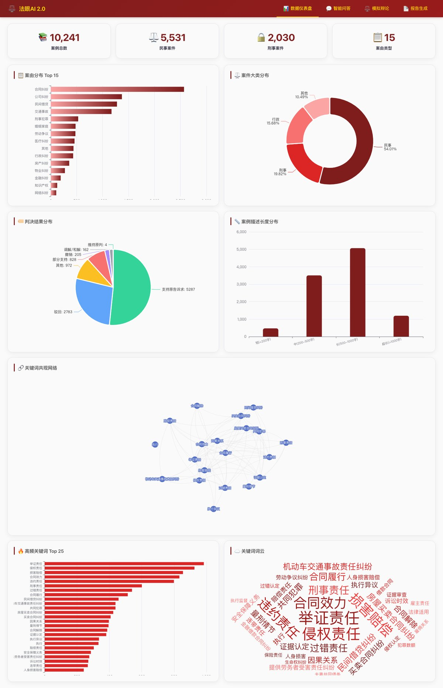
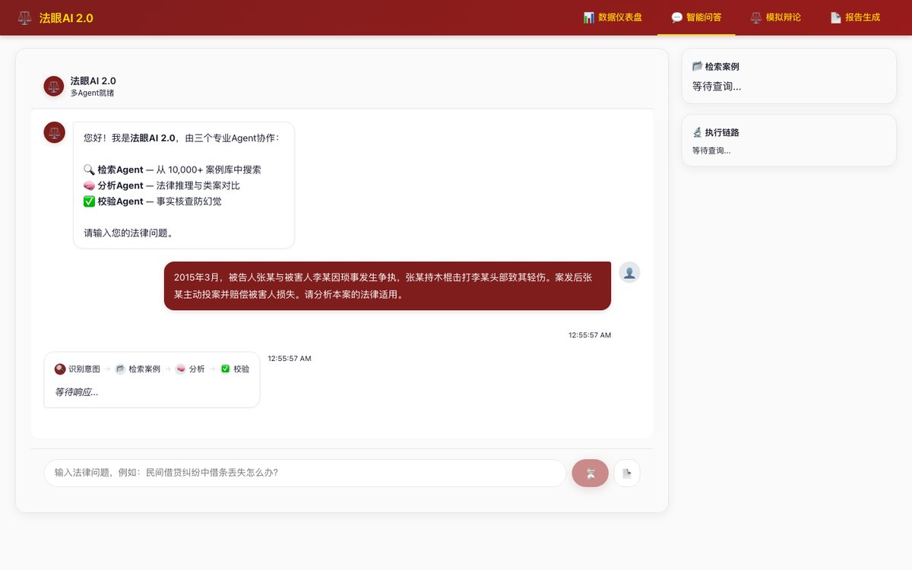
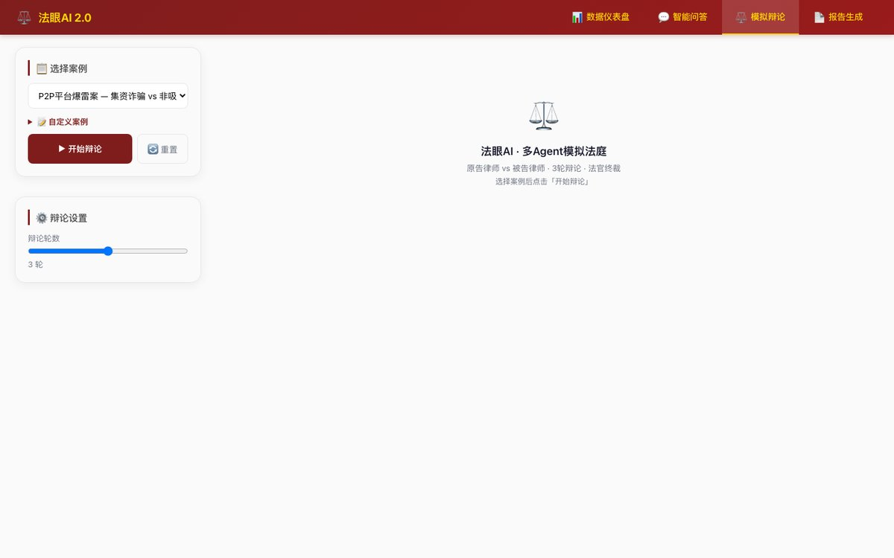
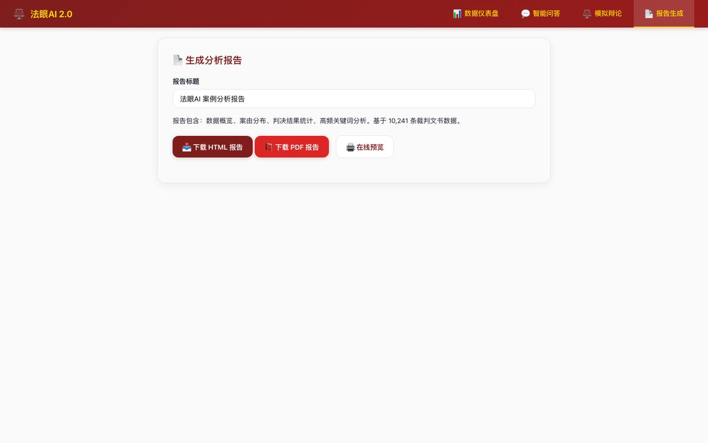

# ⚖️ 法眼AI 2.0 — 智能法律案例分析统一平台

[](https://www.python.org/)
[](https://fastapi.tiangolo.com/)
[](https://langchain-ai.github.io/langgraph/)
[](https://www.docker.com/)
[](LICENSE)

**LangGraph 多Agent协作 + FastAPI + ECharts** 的智能法律案例分析开源平台。

---

## 🏗 架构

```
┌────────────────────────────────────────┐
│         前端 SPA (index.html)           │
│   📊 数据仪表盘  💬 智能问答  📄 报告    │
└────────────────────────────────────────┘
                    │ REST / SSE
                    ▼
┌────────────────────────────────────────┐
│        FastAPI (app.py)                 │
│   /api/dashboard  /api/agent  /api/report│
└────────────────────────────────────────┘
         │              │            │
         ▼              ▼            ▼
┌────────────┐ ┌────────────┐ ┌──────────┐
│ LangGraph   │ │ 数据分析    │ │ PDF报告   │
│ 多Agent     │ │ 10,241条    │ │ Chrome    │
│ 协作系统     │ │ 裁判文书    │ │ 无头渲染   │
└────────────┘ └────────────┘ └──────────┘
```

## ✨ 功能模块

### 📊 数据仪表盘
- 基于 10,241 条裁判文书数据的可视化分析
- 7 张 ECharts 交互图表：案由分布、大类饼图、判决结果、关键词柱状图、篇幅箱线图、关键词共现网络、词云图
- 数据预计算 + 内存缓存，API 响应 < 10ms

### 💬 智能问答（多Agent协作）
- **检索Agent**: BM25 + TF-IDF 混合检索 Top 3 相似案例
- **分析Agent**: LLM 法律分析，引用法条与类案
- **校验Agent**: 事实核查，防幻觉，自动修订循环
- LangGraph 状态机编排: 意图识别 → 检索 → 分析 → 校验 → 格式化输出
- SSE 流式输出，ChatGPT 风格 UI（玻璃拟态、Markdown 渲染）

### ⚖️ 模拟辩论
- 三Agent 对抗辩论：原告 Agent vs 被告 Agent vs 法官 Agent
- SSE 流式实时推送辩论进程
- 支持 1~5 轮可配置辩论深度

### 📄 报告生成
- 一键生成 HTML/PDF 分析报告
- AI 输出智能美化（Unicode 框线图 → 精美信息卡片）
- Chrome Headless 渲染 PDF


## 🖥 效果展示

| 数据仪表盘 | 智能问答 |
|------------|----------|
|  |  |

| 模拟辩论 | 报告生成 |
|----------|----------|
|  |  |


---

## 🚀 快速启动

### 方式一：Python 直接启动（推荐开发调试）

```bash
# 1. 安装依赖（一次性）
pip3 install fastapi uvicorn langgraph langchain langchain-openai \
  scikit-learn numpy jieba rank_bm25 python-dotenv

# 2. 设置 MiniMax API Key
export MINIMAX_API_KEY=sk-your-key-here

# 3. 预计算仪表盘数据（首次必须，约 5 秒）
cd platform
python3 data.py

# 4. 启动服务（前台运行，Ctrl+C 停止）
python3 app.py

# 5. 浏览器打开
open http://localhost:8800
```

终端输出 `Uvicorn running on http://0.0.0.0:8800` 即启动成功。

> 💡 **为什么用 Python 启动？** 改代码后 `Ctrl+C` → `python3 app.py`，3 秒生效。Docker 每次要重构建镜像（30 秒+），开发效率低。

### 方式二：Docker 一键部署（推荐分发/演示）

```bash
# 对方无需装 Python、配依赖、下载数据——一个命令跑起来
export MINIMAX_API_KEY=your_key_here
docker-compose up -d
open http://localhost:8800
```

| 场景 | 推荐方式 |
|------|---------|
| 自己开发 / 改代码 | Python `python3 app.py` |
| 给别人用 / 演示 | Docker `docker-compose up -d` |

> 首次启动约 30 秒预计算数据。停止: `Ctrl+C` (Python) / `docker-compose down` (Docker)

## 🔧 数据清洗流水线

原始裁判文书数据（10,321 条 × 15 列）经过 6 阶段清洗，修复关键词、原告诉求、判决结果三大类的质量问题。

| 指标 | 清洗前 | 清洗后 |
|------|--------|--------|
| 关键词符号连接 | 4,947+ | **0** |
| 关键词空值 | ~10,000 | **32** |
| 原告诉求填充率 | 34.5% | **100%** |
| 判决结果填充率 | ~92% | **~100%** |

```bash
cd data-cleaning
python3 fix_kw_swap.py          # Swap机制去重
python3 fix_empty_dup.py         # 空值修复 (LLM)
python3 fix_final_34.py          # 顽固符号行
python3 fix_claims_all_rows.py   # 原告诉求重写
python3 fix_judgment_final.py    # 判决结果修复
python3 extract_perfect.py       # 导出完美行
```

> 详见 [data-cleaning/README.md](data-cleaning/README.md)

---

## 📂 项目结构

```
├── platform/                 # Web 平台
│   ├── app.py                # FastAPI 入口
│   ├── agents.py             # LangGraph 多Agent
│   ├── data.py               # 仪表盘预计算
│   ├── templates/index.html  # SPA 前端 (1122行)
│   └── static/lib/           # ECharts, marked.js
├── data-cleaning/            # 数据清洗流水线 (6阶段)
├── Dockerfile
├── docker-compose.yml
└── docker-entrypoint.sh
```

---

## 🛠 技术栈

| 层级 | 技术 |
|------|------|
| **LLM 编排** | LangChain, LangGraph |
| **后端** | FastAPI, Uvicorn, SSE Streaming |
| **前端** | Vanilla HTML/CSS/JS, ECharts 5.5, marked.js |
| **检索** | BM25, TF-IDF char-ngram, jieba |
| **数据清洗** | Python CSV, ThreadPoolExecutor, DeepSeek API |
| **部署** | Docker, docker-compose, GitHub Actions CI |

---

## 📄 License

MIT © [Mikenvala](https://github.com/Mikenvala)
